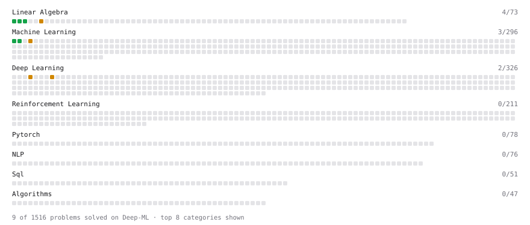

# Deep-ML

My machine learning practice from [Deep-ML](https://www.deep-ml.com). Every solution here was written by hand.

**13** solved · 13 problems · 0 labs · 0 math

[**Browse the interactive portfolio**](https://vivek6337.github.io/deep-ml/) to replay this filling in over time.

## Problems

| | Difficulty | Solved | |
| --- | --- | --- | --- |
| [Binary Classification with Logistic Regression](https://www.deep-ml.com/problems/104) | easy | 2026-09-02 | [solution](problems/0104-binary-classification-with-logistic-regression) |
| [Linear Regression Using Gradient Descent](https://www.deep-ml.com/problems/15) | easy | 2025-05-23 | [solution](problems/0015-linear-regression-using-gradient-descent) |
| [Linear Regression Using Normal Equation](https://www.deep-ml.com/problems/14) | easy | 2025-05-23 | [solution](problems/0014-linear-regression-using-normal-equation) |
| [Matrix-Vector Dot Product](https://www.deep-ml.com/problems/1) | easy | 2025-05-24 | [solution](problems/0001-matrix-vector-dot-product) |
| [Reshape Matrix](https://www.deep-ml.com/problems/3) | easy | 2025-05-24 | [solution](problems/0003-reshape-matrix) |
| [Transpose of a Matrix](https://www.deep-ml.com/problems/2) | easy | 2025-05-24 | [solution](problems/0002-transpose-of-a-matrix) |
| [Calculate Eigenvalues of a Matrix](https://www.deep-ml.com/problems/6) | medium | 2025-05-24 | [solution](problems/0006-calculate-eigenvalues-of-a-matrix) |
| [Implement Adam Optimization Algorithm](https://www.deep-ml.com/problems/49) | medium | 2025-05-27 | [solution](problems/0049-implement-adam-optimization-algorithm) |
| [K-Means Clustering](https://www.deep-ml.com/problems/17) | medium | 2025-05-25 | [solution](problems/0017-k-means-clustering) |
| [Principal Component Analysis (PCA) Implementation](https://www.deep-ml.com/problems/19) | medium | 2025-05-27 | [solution](problems/0019-principal-component-analysis-pca-implementation) |
| [Simple Convolutional 2D Layer](https://www.deep-ml.com/problems/41) | medium | 2025-05-25 | [solution](problems/0041-simple-convolutional-2d-layer) |
| [Single Neuron with Backpropagation](https://www.deep-ml.com/problems/25) | medium | 2025-05-25 | [solution](problems/0025-single-neuron-with-backpropagation) |
| [Train Logistic Regression with Gradient Descent](https://www.deep-ml.com/problems/106) | hard | 2026-09-02 | [solution](problems/0106-train-logistic-regression-with-gradient-descent) |

---

_This file is regenerated by Deep-ML on every push._
